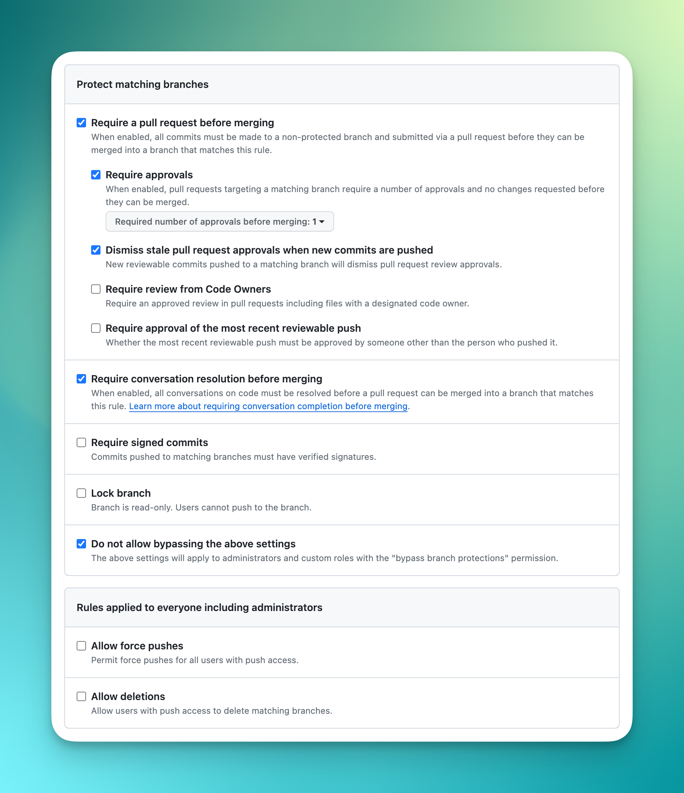

## 相关链接

### web 版在线地址
 https://design-lite-ui.vercel.app

### 项目单元测试覆盖率报告 
 https://unit-test-coverage.vercel.app

## 发布流程

### 从主分支上创建一个 `release` 分支

### 切回主分支再创建一个 `release/版本号` 格式的分支名称，发起一个新的 `PR`

该 `PR` 要做的事情，就是修改 `ChangeLog.h` 文件里的日志，作为更新日志使用

### 当这个 `PR` 通过后，立即发起一个从主分支合并到 `release` 分支的 `PR` ，启动发布流程

### 当发布流程顺利走完以后

- 删除 `release` 分支
- 锁定主分支
- 从主分支创建下一个版本的分支出来，作为新的主分支
- 给新的主分支添加规则

#### 新的主分支规则如图：

